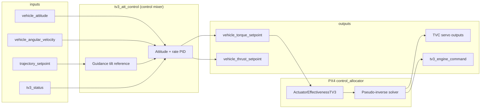

# TV3 Control Mixer

This document describes the control stack for the triple-engine splay-throttle lander
(`tv3_lander_v1`). The stack is split across two layers:

1. An attitude **mixer** (`tv3_att_control`) that produces wrench setpoints.
2. PX4's **control allocator** (`ActuatorEffectivenessTV3`) that maps those setpoints
   onto per-engine TVC actuators.

The single-engine ascent vehicle (`tv3_v1`) uses the same attitude mixer and allocator
airframe type, but with one TVC group and no splay throttle.

## Architecture



SITL startup order from `overlay/ROMFS/init.d-posix/airframes/tv3_common.post`:

```text
control_allocator start
tv3_motor_model start
tv3_load_cell start
tv3_mode_manager start
tv3_att_control start
```

## Layer 1: `tv3_att_control` — attitude mixer

Source: `src/modules/control_mixer/tv3_att_control.cpp`

This module runs at 100 Hz on the rate-control work queue. It is **not** the per-engine
mixer; it closes the attitude loop and publishes body-frame wrench demands.

### Inputs and outputs

| Direction | uORB topic | Role |
|-----------|------------|------|
| In | `vehicle_attitude` | Current body attitude |
| In | `vehicle_angular_velocity` | Body rates and derivatives |
| In | `trajectory_setpoint` | Guidance velocity/position commands |
| In | `tv3_status` | Flight mode, rail exit, abort state |
| In | `tv3_thrust` | Trusted thrust signal (load cell or reference) |
| Out | `vehicle_torque_setpoint` | Roll/pitch/yaw torque demand (Nm) |
| Out | `vehicle_thrust_setpoint` | Normalized axial thrust command |

Torque outputs are clamped by `RK_TQ_R_MAX`, `RK_TQ_P_MAX`, and `RK_TQ_Y_MAX`.
During powered flight the thrust setpoint is `1.0` on the body +X axis; otherwise it
is zero.

### Controller structure

Quaternion attitude error is converted to a small-angle vector, then fed through a
rate loop:

1. Attitude error × `RK_ATT_P_*` → rate setpoint
2. Rate error × `RK_RATE_P_*` + integrator (`RK_RATE_I`) − D-term (`RK_RATE_D`) → torque

The module zeros all outputs when the vehicle is not ready, is in abort, or is coasting
without guidance enabled.

### Gain scheduling

| Phase | Att P param | Rate P param | Integrator limit |
|-------|-------------|--------------|------------------|
| On rail (`!rail_exit`) | `RK_ATT_P_RAIL` (2.0) | `RK_RATE_P_RAIL` (0.35) | 5 |
| Free flight | `RK_ATT_P_FREE` (4.0) | `RK_RATE_P_FREE` (1.0) | 5 |
| Powered (ignition / boost / coast) | `RK_ATT_P_BOOST` (10.0) | `RK_RATE_P_BOOST` (2.5) | 20 |

Lander manifest defaults for torque limits (`config/vehicles/tv3_lander_v1.json`):

| Axis | Limit (Nm) |
|------|------------|
| Roll | 8 |
| Pitch | 16 |
| Yaw | 16 |

### Guidance coupling

When `RK_GD_ENABLE=1`, horizontal velocity and position commands from
`trajectory_setpoint` tilt the attitude reference away from the launch quaternion.
Tilt magnitude is `horiz_speed × RK_ATT_TILT_GAIN`, capped at `RK_ATT_TILT_MAX`
(default 20°). This steers thrust laterally without bypassing the attitude loop.

## Layer 2: PX4 control allocator — per-engine TVC mixing

The patched PX4 allocator (`CA_AIRFRAME=16`, `ActuatorEffectivenessTV3` in
`patches/px4/0001-tv3-control-allocation.patch`) takes `vehicle_torque_setpoint`
and solves for per-engine pitch and yaw servo deflections.

### Effectiveness model

For each TVC group the allocator builds two servo actuators using a small-angle
linearization:

```text
τ = T_ref × thrust_fraction × θ_max × (r × (gimbal_axis × thrust_axis))
```

A gimbal rotation about `gimbal_axis` deflects thrust by approximately
`gimbal_axis × thrust_axis`. Torque comes from the lever arm `r` (engine mount
position relative to the vehicle CG).

Firmware implementation: `ActuatorEffectivenessTV3::computeTorque()` in the PX4
patch. Host mirror: `flight_effectiveness_torque()` in `tools/tv3_control_allocator.py`.

### Per-engine geometry (`tv3_lander_v1`)

Three engines sit on a **120° triangular ring** at the nozzle-exit plane (x = 0 m,
radius 98 mm):

| Engine | Position (m) | Roll axis (primary) | Yaw axis (secondary) |
|--------|-------------|---------------------|----------------------|
| 0 | (0, +0.098, 0) | toward origin (−Y) | −Z |
| 1 | (0, −0.049, +0.085) | toward origin | rotated 120° |
| 2 | (0, −0.049, −0.085) | toward origin | rotated 240° |

Shared geometry for all engines:

- **Thrust axis:** +X (body forward) at zero gimbal
- **Roll range:** ±90° about the mount→origin axis
- **Yaw range:** 0–135° about the perpendicular secondary axis
- **Yaw is coupled to roll** — the yaw hinge axis rotates with roll; roll is not
  coupled to yaw

Axis construction is documented in `tools/tv3_engine_frame.py` and validated by
`tests/test_gimbal_axes.py`. The kinematic chain is implemented in
`plant_thrust_direction()` (`tools/tv3_control_allocator.py`) and mirrored in the SIH
plant (`src/modules/simulation/tv3_sih/tv3_sih.cpp`).

### Generated `CA_RK_*` parameters

`tools/generate_vehicle_assets.py` maps the vehicle manifest into allocator params:

| Parameter group | Content |
|-----------------|---------|
| `CA_RK_GRP_CNT` | Number of TVC groups (3 for lander) |
| `CA_RK_G{i}_PX/PY/PZ` | Engine mount position (m) |
| `CA_RK_G{i}_AX/AY/AZ` | Nominal thrust axis |
| `CA_RK_G{i}_PAX/PAY/PAZ` | Roll axis (legacy "pitch" param names in firmware) |
| `CA_RK_G{i}_YAX/YAY/YAZ` | Yaw axis |
| `CA_RK_G{i}_PMAX/YMAX` | Roll/yaw deflection limits (deg) |
| `CA_RK_G{i}_TF` | Thrust fraction (⅓ per engine on lander) |
| `CA_RK_G{i}_PTR/YTR` | Roll and yaw trim |
| `CA_RK_REF_THR` | Reference thrust for normalizing the effectiveness matrix (750 N) |
| `CA_RK_MIN_THR` / `CA_RK_FAL_THR` | Minimum and fallback thrust estimates |

See also [Hardware Flight Workflow](hardware_flight_workflow.md) for the preflight
parameter checklist.

## Layer 3: Splay — throttle (not allocator output)

Each lander engine has a **third DOF: splay** (0–35°), which is the throttle
mechanism. Thrust magnitude follows cosine loss:

```text
T_actual = T_nominal × cos(splay_deg)
```

With Aerotech G12 motors at the current catalog values:

| Condition | Total thrust (3 engines) |
|-----------|--------------------------|
| Splay = 0° (full throttle) | **92.6 N** (~30.9 N each) |
| Splay = 35° (min throttle) | **75.9 N** |

Net thrust can only be reduced ~18% via splay alone. Demanding less than ~76 N with
all engines active is **unreachable** — the host allocator returns
`net thrust outside splay envelope`.

Splay (collective secondary-axis deflection for thrust modulation) is applied in
`tv3_mode_manager` as a **common-mode bias added to the allocator's secondary-axis
commands**. The secondary actuator is shared (splay is not an independent DOF).
Allocator commands provide the differential for attitude torques; splay provides
the common component for net thrust reduction. The final `commanded_yaw_deg[]`
(and `commanded_splay_deg[]`) therefore contain `allocator_secondary + splay_common`
for each engine. This prevents splay from disabling attitude authority on the
secondary mount actuator.

## Host-side reachability checker

`tools/tv3_control_allocator.py` mirrors the firmware allocator small-angle model and
the SIH plant splay/pitch/yaw thrust model. It uses a bounded grid search over
per-engine `(roll, yaw, splay)` commands to check whether a wrench demand is
physically achievable.

Run the Phase 4 gate:

```bash
./scripts/check_control_mixer.sh
```

Or query a specific demand directly:

```bash
python3 tools/tv3_allocator.py \
  --vehicle config/vehicles/tv3_lander_v1.json \
  --thrust 92.6 \
  --torque 0 0 0
```

### Validated behaviors

| Scenario | Expected result |
|----------|-----------------|
| Nominal hover (zero torque, full thrust) | Reachable; all gimbals at trim |
| Thrust below splay floor (~40 N) | Unreachable (`net thrust outside splay envelope`) |
| One engine failed, full thrust demanded | Unreachable (reduced envelope) |
| Burnout-scaled thrust (~55%) | Still hoverable |
| Excessive lateral guidance demand | Torque envelope rejection |

Unit tests live in `tests/test_control_allocator.py`.

## SIH simulation bridge

The SIH plant (`tv3_sih`) is a forward-only 6DOF model: it applies the gimbal angles
received on `tv3_engine_command` (populated by `tv3_mode_manager` from allocator servos
and the collective splay computation) directly to the thrust vectors from the motor model.
No torque-to-gimbal synthesis or guidance thrust scaling occurs in the plant.

On hardware, allocator servo outputs drive real TVC actuators. The host grid solver
is the authoritative offline model for whether a given wrench is physically achievable.

## Related topics for log review

When reviewing control behavior in ULog, the relevant topics include:

```text
vehicle_torque_setpoint
vehicle_thrust_setpoint
actuator_servos
tv3_engine_command
control_allocator_status
```

See [Data Visualization](data_visualization.md) for the full logger profile and
plotting workflow.

## Summary

| Layer | Module | Role |
|-------|--------|------|
| Attitude mixer | `tv3_att_control` | PID → torque + normalized thrust setpoints |
| Per-engine mixer | PX4 `control_allocator` + `ActuatorEffectivenessTV3` | Torque → 6 servo commands (roll+yaw × 3 engines) |
| Throttle | Splay mechanism + `tv3_guidance` | Cosine-loss thrust modulation, 92.6→75.9 N range |
| Validation | `tv3_control_allocator.py` | Offline envelope + grid allocation checks |
| Plant | `tv3_sih` | Full nonlinear gimbal kinematics + splay |

The triple-engine lander uses **differential gimbaling** across three offset nozzles to
generate pitch, yaw, and roll torque, with **splay** as a shared throttle axis. The
attitude mixer decides *what wrench* is needed; the allocator decides *how to split it
across six gimbal servos* subject to geometry, thrust fraction, and deflection limits.