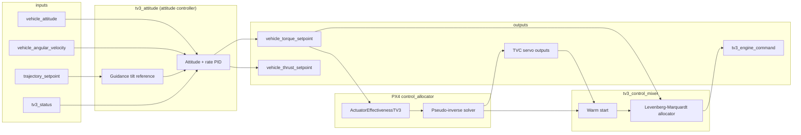

# TV3 Control Mixer

This document describes the control stack for the triple-engine splay-throttle lander
(`tv3_lander_v1`). The stack is split across two layers:

1. An attitude **controller** (`tv3_attitude`) that produces wrench setpoints.
2. PX4's **control allocator** (`ActuatorEffectivenessTV3`) that maps those setpoints
   onto per-engine TVC actuators.
3. A TV3 **control mixer** (`tv3_control_mixer`) that combines allocator servo outputs
   with a bounded Levenberg-Marquardt nonlinear allocator into `tv3_engine_command`.

The single-engine ascent vehicle (`tv3_v1`) uses the same attitude mixer and allocator
airframe type, but with one TVC group and no splay throttle.

## Architecture



SITL startup order from `overlay/ROMFS/init.d-posix/airframes/tv3_common.post`:

```text
control_allocator start
tv3_motor_model start
tv3_load_cell start
tv3_mode_manager start
tv3_attitude start
tv3_control_mixer start
```

## Layer 1: `tv3_attitude` — attitude controller

Source: `src/modules/tv3_attitude/tv3_attitude.cpp`

This module runs at 100 Hz on the rate-control work queue. It closes the attitude loop
and publishes body-frame wrench demands. It does **not** perform per-engine mixing.

### Inputs and outputs

| Direction | uORB topic | Role |
|-----------|------------|------|
| In | `vehicle_attitude` | Current body attitude |
| In | `vehicle_angular_velocity` | Body rates and derivatives |
| In | `trajectory_setpoint` | Guidance velocity/position commands |
| In | `tv3_status` | Flight mode, rail exit, abort state |
| In | `tv3_thrust` | Trusted thrust signal (load cell or reference) |
| Out | `vehicle_torque_setpoint` | Roll/pitch/yaw torque demand (Nm) |
| Out | `vehicle_thrust_setpoint` | Normalized axial thrust command |

Torque outputs are clamped by `RK_TQ_R_MAX`, `RK_TQ_P_MAX`, and `RK_TQ_Y_MAX`.
During powered flight the thrust setpoint is `1.0` on the body +X axis; otherwise it
is zero.

### Controller structure

Quaternion attitude error is converted to a small-angle vector, then fed through a
rate loop:

1. Attitude error × `RK_ATT_P_*` → rate setpoint
2. Rate error × `RK_RATE_P_*` + integrator (`RK_RATE_I`) − D-term (`RK_RATE_D`) → torque

The module zeros all outputs when the vehicle is not ready, is in abort, or is coasting
without guidance enabled.

### Gain scheduling

| Phase | Att P param | Rate P param | Integrator limit |
|-------|-------------|--------------|------------------|
| On rail (`!rail_exit`) | `RK_ATT_P_RAIL` (2.0) | `RK_RATE_P_RAIL` (0.35) | 5 |
| Free flight | `RK_ATT_P_FREE` (4.0) | `RK_RATE_P_FREE` (1.0) | 5 |
| Powered (ignition / boost / coast) | `RK_ATT_P_BOOST` (10.0) | `RK_RATE_P_BOOST` (2.5) | 20 |

Lander manifest defaults for torque limits (`config/vehicles/tv3_lander_v1.json`):

| Axis | Limit (Nm) |
|------|------------|
| Roll | 8 |
| Pitch | 16 |
| Yaw | 16 |

### Guidance coupling

When `RK_GD_ENABLE=1`, horizontal velocity and position commands from
`trajectory_setpoint` tilt the attitude reference away from the launch quaternion.
Tilt magnitude is `horiz_speed × RK_ATT_TILT_GAIN`, capped at `RK_ATT_TILT_MAX`
(default 20°). This steers thrust laterally without bypassing the attitude loop.

### Boost thrust modes

Two runtime parameters select how axial thrust is scheduled during
`MODE_IGNITION_PENDING` and `MODE_BOOST`:

| Param | Effect |
|-------|--------|
| `RK_GD_BOOST_FULL=1` | Guidance sets `required_thrust_n` to the live chamber sum; collective splay is off when `required ≥ chamber`. |
| `RK_GD_BOOST_ATT=1` | Guidance does not schedule thrust (`required_thrust_n=0`); the control mixer drives the LM allocator with measured chamber thrust and zero collective splay. Attitude holds the launch vector without guidance envelope gating. |

`RK_GD_BOOST_ATT` takes precedence when both are set. Either param can be changed
in flight before launch; profile JSON fields are `boost_full_thrust` and
`boost_attitude_only`.

Open boost stability hypotheses (BS-001–BS-029) and discrimination experiments:
[boost_stability_issues.md](boost_stability_issues.md).

## Layer 2: PX4 control allocator — per-engine TVC mixing

The patched PX4 allocator (`CA_AIRFRAME=16`, `ActuatorEffectivenessTV3` in
`patches/px4/0001-tv3-control-allocation.patch`) takes `vehicle_torque_setpoint`
and solves for per-engine pitch and yaw servo deflections.

### Effectiveness model

For each TVC group the allocator builds two servo actuators using a small-angle
linearization:

```text
τ = T_ref × thrust_fraction × θ_max × (r × (gimbal_axis × thrust_axis))
```

A gimbal rotation about `gimbal_axis` deflects thrust by approximately
`gimbal_axis × thrust_axis`. Torque comes from the lever arm `r` (engine mount
position relative to the vehicle CG).

Firmware implementation: `ActuatorEffectivenessTV3::computeTorque()` in the PX4
patch. Host mirror: `flight_effectiveness_torque()` in `tools/tv3_control_allocator.py`.

### Per-engine geometry (`tv3_lander_v1`)

Three engines sit on a **120° triangular ring** at the nozzle-exit plane (x = 0 m,
radius 98 mm):

| Engine | Position (m) | Roll axis (primary) | Yaw axis (secondary) |
|--------|-------------|---------------------|----------------------|
| 0 | (0, +0.098, 0) | toward origin (−Y) | −Z |
| 1 | (0, −0.049, +0.085) | toward origin | rotated 120° |
| 2 | (0, −0.049, −0.085) | toward origin | rotated 240° |

Shared geometry for all engines:

- **Thrust axis:** +X (body forward) at zero gimbal
- **Roll range:** ±90° about the mount→origin axis
- **Yaw range:** 0–135° about the perpendicular secondary axis
- **Yaw is coupled to roll** — the yaw hinge axis rotates with roll; roll is not
  coupled to yaw

Axis construction is documented in `tools/tv3_engine_frame.py` and validated by
`tests/test_gimbal_axes.py`. The kinematic chain is implemented in
`plant_thrust_direction()` (`tools/tv3_control_allocator.py`) and mirrored in the SIH
plant (`src/modules/simulation/tv3_sih/tv3_sih.cpp`).

### Generated `CA_RK_*` parameters

`tools/generate_vehicle_assets.py` maps the vehicle manifest into allocator params:

| Parameter group | Content |
|-----------------|---------|
| `CA_RK_GRP_CNT` | Number of TVC groups (3 for lander) |
| `CA_RK_G{i}_PX/PY/PZ` | Engine mount position (m) |
| `CA_RK_G{i}_AX/AY/AZ` | Nominal thrust axis |
| `CA_RK_G{i}_PAX/PAY/PAZ` | Roll axis (legacy "pitch" param names in firmware) |
| `CA_RK_G{i}_YAX/YAY/YAZ` | Yaw axis |
| `CA_RK_G{i}_PMAX/YMAX` | Roll/yaw deflection limits (deg) |
| `CA_RK_G{i}_TF` | Thrust fraction (⅓ per engine on lander) |
| `CA_RK_G{i}_PTR/YTR` | Roll and yaw trim |
| `CA_RK_REF_THR` | Reference thrust for normalizing the effectiveness matrix (750 N) |
| `CA_RK_MIN_THR` / `CA_RK_FAL_THR` | Minimum and fallback thrust estimates |

See also [Hardware Flight Workflow](hardware_flight_workflow.md) for the preflight
parameter checklist.

## Layer 2.5: `tv3_control_mixer` — gimbal command mixer

Source: `src/modules/tv3_control_mixer/`

| File | Role |
|------|------|
| `tv3_control_mixer.cpp` | uORB I/O, warm start, parameter loading |
| `tv3_gimbal_plant.{hpp,cpp}` | Nonlinear thrust-direction plant (`GimbalPlant`) |
| `tv3_gimbal_lm.{hpp,cpp}` | Bounded Levenberg-Marquardt solver (`solve_gimbal_lm`) |

This module runs at 100 Hz on the rate-control work queue. It subscribes to PX4
`actuator_servos`, `vehicle_torque_setpoint`, `tv3_guidance_status`, `tv3_engine_state`,
and `tv3_status` (for ignition/sequence context from `tv3_mode_manager`). It publishes
the final per-engine gimbal commands on `tv3_engine_command` and allocator diagnostics on
`tv3_allocator_status`.

Responsibilities:

1. Scale normalized allocator servo outputs to degrees using `CA_RK_G*_PMAX/YMAX`.
2. When collective splay mixing is active, run a bounded LM solve over all six gimbal
   angles (primary + secondary per engine).
3. Warm-start each solve from the previous cycle's solution (fall back to allocator
   servos plus an acos splay hint when the ignition mask changes).

### Levenberg-Marquardt allocator

When `collective_throttle_mixer_active()` is true (multi-engine lander, guidance thrust
solution valid, powered flight after rail exit), the mixer jointly solves for angles that
match:

| Residual | Source |
|----------|--------|
| Roll/pitch/yaw torque error | `vehicle_torque_setpoint` |
| Normalized axial thrust error | `tv3_guidance_status.required_thrust_n` |
| Per-engine yaw deviation from mean | Soft symmetric-splay bias |

The forward model (`GimbalPlant`) uses the same nested-gimbal kinematics as the SIH plant
and `plant_thrust_direction()` in `tools/tv3_control_allocator.py`. The Jacobian is
computed with central finite differences (`RK_ALLOC_FD_EPS`, default 0.01 rad).

Each LM iteration:

1. Evaluate residuals and cost `½‖r‖²`.
2. Build `J` via finite differences.
3. Solve `(JᵀJ + λI) δ = −Jᵀr` for a 6×6 correction.
4. Clip proposed angles to per-engine `PMAX` / `YMIN`/`YMAX`.
5. Accept steps that reduce cost (decrease `λ`); reject and increase `λ` otherwise.

The loop stops after `RK_ALLOC_MAX_ITER` iterations (default 12) or when torque and thrust
residuals fall below tolerance.

`commanded_splay_deg[]` is published as the mean secondary-axis angle across active engines
for telemetry. The acos collective-splay estimate remains available as a cold-start hint
when warm start is unavailable.

### Allocator parameters

| Parameter | Default | Purpose |
|-----------|---------|---------|
| `RK_ALLOC_MAX_ITER` | 12 | Hard iteration cap per control cycle |
| `RK_ALLOC_TOL` | 0.15 | Torque residual norm stop (Nm) |
| `RK_ALLOC_LAMBDA0` | 0.01 | Initial LM damping |
| `RK_ALLOC_THR_W` | 1.0 | Axial thrust residual weight (normalized by desired thrust) |
| `RK_ALLOC_SPLAY_W` | 0.1 | Symmetric-splay soft weight |
| `RK_ALLOC_FD_EPS` | 0.01 | Finite-difference Jacobian step (rad) |

### Boundary handling

Hard limits and unreachable demands are handled at each layer:

| Layer | Actuator hard stops | Unrealistic wrench demand |
|-------|---------------------|---------------------------|
| `tv3_guidance` | — | Rejects thrust above chamber total or below splay floor; lateral torque estimate vs `RK_TQ_*_MAX`; aborts phase on runtime envelope failure |
| `tv3_attitude` | Clamps torque to `RK_TQ_R/P/Y_MAX` | Zeros torque when guidance marks `control_solution_valid = false` |
| `tv3_control_mixer` | Clips all pitch/yaw commands to `CA_RK_G*_PMAX/YMIN/YMAX` | Clamps LM torque input; skips LM when guidance control invalid; holds previous converged solution when LM fails |
| Host `allocate()` / `solve_gimbal_lm()` | `_clip_commands()` on every LM step | Early reject outside thrust/torque envelope; `demand_saturated` when clamped or infeasible |

`tv3_allocator_status` publishes `demand_saturated` and `used_fallback_solution` when the LM solver could not meet tolerance and the mixer held the previous cycle or allocator seed.

## Layer 3: Splay — throttle (not allocator output)

Each lander engine has a **third DOF: splay** (0–35°), which is the throttle
mechanism. Thrust magnitude follows cosine loss:

```text
T_actual = T_nominal × cos(splay_deg)
```

With Aerotech G12 motors at the current catalog values:

| Condition | Total thrust (3 engines) |
|-----------|--------------------------|
| Splay = 0° (full throttle) | **92.6 N** (~30.9 N each) |
| Splay = 35° (min throttle) | **75.9 N** |

Net thrust can only be reduced ~18% via splay alone. Demanding less than ~76 N with
all engines active is **unreachable** — the host allocator returns
`net thrust outside splay envelope`.

Splay (collective secondary-axis deflection for thrust modulation) is solved inside the
LM allocator together with differential attitude authority. The secondary actuator is
shared (splay is not an independent DOF). Allocator servo outputs seed differential
torque; the LM step finds yaw angles that jointly satisfy thrust demand, torque demand,
and symmetric splay. The final `commanded_yaw_deg[]` therefore contain the solved
secondary-axis angles; `commanded_splay_deg[]` reports their collective mean.

## Host-side reachability checker

`tools/tv3_control_allocator.py` mirrors the firmware allocator small-angle model and
the SIH plant splay/pitch/yaw thrust model. It provides:

- `allocate()` — bounded grid search for offline reachability checks
- `solve_gimbal_lm()` — Python mirror of the firmware LM solver for regression tests
- `run_lm_sweep()` — envelope sweep with grid reachability oracle and firmware-like warm starts
- `tools/tune_gimbal_lm.py` — CLI report, optional `--tune` param search, and CI gate

Run the Phase 4 gate:

```bash
./scripts/check_control_mixer.sh
```

### LM allocator tuning sweep

Before flashing firmware parameter changes, run a host-side convergence sweep across the
thrust/torque envelope:

```bash
# Summary table
python3 tools/tune_gimbal_lm.py --vehicle config/vehicles/tv3_lander_v1.json

# JSON report for inspection or diffing
python3 tools/tune_gimbal_lm.py \
  --vehicle config/vehicles/tv3_lander_v1.json \
  --output build/lm_sweep.json

# Preview alternate RK_ALLOC_* values
python3 tools/tune_gimbal_lm.py \
  --vehicle config/vehicles/tv3_lander_v1.json \
  --max-iter 16 --thrust-weight 2.0

# Offline coarse search over LmConfig
python3 tools/tune_gimbal_lm.py \
  --vehicle config/vehicles/tv3_lander_v1.json \
  --tune --max-tune-trials 50
```

The sweep uses the grid allocator as a **reachability oracle**: demands the grid can
approximate (including collective splay hints at reduced thrust) are treated as reachable;
unreachable envelope corners are skipped. `tests/test_gimbal_lm_convergence.py` gates CI on
≥90% LM convergence for reachable demands.

Typical workflow:

1. Run the sweep and note `reachable_failed` clusters (thrust fraction, torque axis).
2. Adjust `RK_ALLOC_THR_W`, `RK_ALLOC_SPLAY_W`, or `RK_ALLOC_MAX_ITER` based on failure mode.
3. Re-run with `--tune` or manual `--thrust-weight` overrides until the convergence rate is acceptable.
4. Update `src/modules/tv3_params/tv3_params.c` and rebuild SIH.

Or query a specific demand directly:

```bash
python3 tools/tv3_allocator.py \
  --vehicle config/vehicles/tv3_lander_v1.json \
  --thrust 92.6 \
  --torque 0 0 0
```

### Validated behaviors

| Scenario | Expected result |
|----------|-----------------|
| Nominal hover (zero torque, full thrust) | Reachable; LM converges in ≤6 iterations |
| Thrust above full envelope (~100 N) | Unreachable (`net thrust outside splay envelope`) |
| One engine failed, full thrust demanded | Unreachable (reduced envelope) |
| Burnout-scaled thrust (~55%) | Still hoverable |
| Excessive lateral guidance demand | Torque envelope rejection |

Unit tests live in `tests/test_control_allocator.py`, `tests/test_gimbal_lm.py`, and
`tests/test_gimbal_lm_convergence.py`.

## SIH simulation bridge

The SIH plant (`tv3_sih`) is a forward-only 6DOF model: it applies the gimbal angles
received on `tv3_engine_command` (populated by `tv3_control_mixer` from allocator servos
and the collective splay computation) directly to the thrust vectors from the motor model.
No torque-to-gimbal synthesis or guidance thrust scaling occurs in the plant.

On hardware, allocator servo outputs drive real TVC actuators. The host grid solver
is the authoritative offline model for whether a given wrench is physically achievable.

## Related topics for log review

When reviewing control behavior in ULog, the relevant topics include:

```text
vehicle_torque_setpoint
vehicle_thrust_setpoint
actuator_servos
tv3_engine_command
tv3_allocator_status
control_allocator_status
```

See [Data Visualization](data_visualization.md) for the full logger profile and
plotting workflow.

## Summary

| Layer | Module | Role |
|-------|--------|------|
| Attitude controller | `tv3_attitude` | PID → torque + normalized thrust setpoints |
| Per-engine allocator | PX4 `control_allocator` + `ActuatorEffectivenessTV3` | Torque → 6 servo commands (roll+yaw × 3 engines) |
| Gimbal mixer | `tv3_control_mixer` | Allocator servos + LM nonlinear solve → `tv3_engine_command` |
| Throttle | Splay mechanism + `tv3_guidance` | Cosine-loss thrust modulation, 92.6→75.9 N range |
| Validation | `tv3_control_allocator.py` | Offline envelope, grid checks, and LM regression tests |
| Plant | `tv3_sih` | Full nonlinear gimbal kinematics + splay |

The triple-engine lander uses **differential gimbaling** across three offset nozzles to
generate pitch, yaw, and roll torque, with **splay** as a shared throttle axis. The
attitude controller decides *what wrench* is needed; the allocator decides *how to split
differential torque across six gimbal servos*; `tv3_control_mixer` refines that seed with
a bounded LM solve that jointly matches torque, net thrust, and symmetric splay.