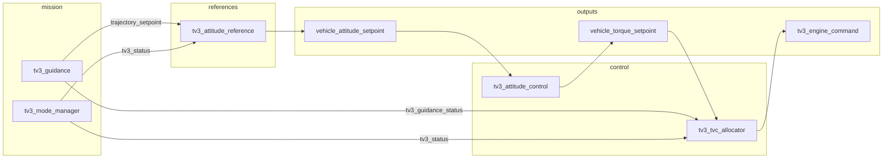

# TV3 Control Mixer

This document describes the control stack for the triple-engine splay-throttle lander
(`tv3_lander_v1`). The stack follows the control pipeline:

1. `tv3_attitude_reference` — launch frame, guidance tilt, and roll program → `vehicle_attitude_setpoint`
2. `tv3_attitude_control` — attitude/rate PID → `vehicle_torque_setpoint`
3. `tv3_tvc_allocator` — joint projected-GD solver → per-engine TVC commands in `tv3_engine_command`

`tv3_mode_manager` owns vehicle state and ignition sequencing; it publishes `tv3_status`
including propulsion sequencing fields consumed by the allocator.

The stock PX4 `control_allocator` + `ActuatorEffectivenessTV3` still execute (for
parameter geometry and logging), but their servo outputs are not used to synthesize
commands.

The single-engine ascent vehicle (`tv3_v1`) uses the same attitude mixer; the joint
solver degenerates gracefully with thrust error down-weighted or disabled when splay
is not available.

## Architecture



SITL startup order from `overlay/ROMFS/init.d-posix/airframes/tv3_common.post`:

```text
control_allocator start
tv3_motor_model start
tv3_load_cell start
tv3_mode_manager start
tv3_guidance start            # when RK_GD_ENABLE=1
tv3_attitude_reference start
tv3_attitude_control start
tv3_tvc_allocator start
```

(Note: `control_allocator` still starts for parameter loading and `control_allocator_status`
logging, but its servo outputs are not used for TVC command synthesis.)

## Layer 1: `tv3_attitude_reference`

Source: `src/modules/control/reference/tv3_attitude_reference.cpp`

Publishes `vehicle_attitude_setpoint` from the launch-frame quaternion, optional
guidance tilt from `trajectory_setpoint`, and the configured roll program.

## Layer 2: `tv3_attitude_control`

Source: `src/modules/control/attitude/tv3_attitude_control.cpp`

This module runs at 100 Hz on the rate-control work queue. It is **not** the per-engine
mixer; it closes the attitude loop and publishes body-frame wrench demands.

### Inputs and outputs

| Direction | uORB topic | Role |
|-----------|------------|------|
| In | `vehicle_attitude` | Current body attitude |
| In | `vehicle_angular_velocity` | Body rates and derivatives |
| In | `vehicle_attitude_setpoint` | Desired attitude quaternion |
| In | `tv3_status` | Flight mode, rail exit, abort state |
| Out | `vehicle_torque_setpoint` | Roll/pitch/yaw torque demand (Nm) |
| Out | `vehicle_thrust_setpoint` | Normalized axial thrust command |

Torque outputs are clamped by `RK_TQ_R_MAX`, `RK_TQ_P_MAX`, and `RK_TQ_Y_MAX`.
During powered flight the thrust setpoint is `1.0` on the body +X axis; otherwise it
is zero.

### Controller structure

Quaternion attitude error is converted to a small-angle vector, then fed through a
rate loop:

1. Attitude error × `RK_ATT_P_*` → rate setpoint
2. Rate error × `RK_RATE_P_*` + integrator (`RK_RATE_I`) − D-term (`RK_RATE_D`) → torque

The module zeros all outputs when the vehicle is not ready, is in abort, or is coasting
without guidance enabled.

### Gain scheduling

| Phase | Att P param | Rate P param | Integrator limit |
|-------|-------------|--------------|------------------|
| On rail (`!rail_exit`) | `RK_ATT_P_RAIL` (2.0) | `RK_RATE_P_RAIL` (0.35) | 5 |
| Free flight | `RK_ATT_P_FREE` (4.0) | `RK_RATE_P_FREE` (1.0) | 5 |
| Powered (ignition / boost / coast) | `RK_ATT_P_BOOST` (10.0) | `RK_RATE_P_BOOST` (2.5) | 20 |

Lander manifest defaults for torque limits (`config/vehicles/tv3_lander_v1.json`):

| Axis | Limit (Nm) |
|------|------------|
| Roll | 8 |
| Pitch | 16 |
| Yaw | 16 |

### Guidance coupling

Guidance tilt and roll-program shaping are implemented in `tv3_attitude_reference`.
When `RK_GD_ENABLE=1`, horizontal velocity and position commands from
`trajectory_setpoint` tilt the attitude reference away from the launch quaternion.
Tilt magnitude is `horiz_speed × RK_ATT_TILT_GAIN`, capped at `RK_ATT_TILT_MAX`
(default 20°). `tv3_attitude_control` tracks the resulting `vehicle_attitude_setpoint`.

## Layer 3: Joint projected-gradient allocation (torque + thrust)

TV3 does **not** use the stock PX4 allocator's servo outputs as the source of gimbal
commands for flight. The allocator (`ActuatorEffectivenessTV3`) and its small-angle
linearization still run (for `control_allocator_status` and geometry params), but
`tv3_tvc_allocator` ignores those servos for synthesis and instead runs a live
weighted projected gradient descent solver at 100 Hz that jointly solves for
per-engine roll/yaw angles to achieve both the desired body torque **and** the
net axial thrust.

### Why joint nonlinear allocation

- The small-angle model `τ ≈ T_ref·θ_max·(r × (â × t̂))` only holds near zero deflection.
- Net thrust is produced by collective secondary-axis deflection ("splay"), which
  immediately invalidates the linearization used by the allocator.
- Previously a post-hoc splay bias was added and a torque-only refinement performed,
  followed by a "restore common splay" step. Thrust and torque were never optimized
  together and the final commands could sacrifice one for the other.

The new solver:

- Uses the exact nonlinear forward model (`plant_thrust_direction` / Rodrigues
  rotations + `r × F`) already used by `tv3_sih`.
- Minimizes a weighted residual combining torque error (Nm) and axial thrust error (N).
- Respects actuator limits by projection after each step.
- Is warm-started from the previous solution (or a collective-splay guess).
- Replaces allocator-scale + splay + torque-only refine + splay-restore entirely.

Host reference implementation (and offline checker): `allocate_projected_gradient()` in
`tools/tv3_control_allocator.py`. The public `allocate()` now delegates to it.

Default weighting makes a 1 N thrust error roughly comparable to a 0.02 Nm torque
error in the combined cost (matching historical scoring). The implementation uses a
smooth quadratic proxy on the 4-D residual with coordinate-wise normalized steps
and projection. 

Firmware: implemented in `tv3_tvc_allocator` using `src/lib/tv3/`. The shared plant
kinematics helpers (`thrust_direction_at`, `total_torque_nm`, `total_axial_thrust_n`)
keep the flight solver aligned with `tv3_sih` and the host checker for a given
(thrusts, angles) pair.

### Per-engine geometry (`tv3_lander_v1`)

Three engines sit on a **120° triangular ring** at the nozzle-exit plane (x = 0 m,
radius 98 mm):

| Engine | Position (m) | Roll axis (primary) | Yaw axis (secondary) |
|--------|-------------|---------------------|----------------------|
| 0 | (0, +0.098, 0) | toward origin (−Y) | −Z |
| 1 | (0, −0.049, +0.085) | toward origin | rotated 120° |
| 2 | (0, −0.049, −0.085) | toward origin | rotated 240° |

Shared geometry for all engines:

- **Thrust axis:** +X (body forward) at zero gimbal
- **Roll range:** ±90° about the mount→origin axis
- **Yaw range:** 0–135° about the perpendicular secondary axis
- **Yaw is coupled to roll** — the yaw hinge axis rotates with roll; roll is not
  coupled to yaw

Axis construction is documented in `tools/tv3_engine_frame.py` and validated by
`tests/test_gimbal_axes.py`. The kinematic chain is implemented in
`plant_thrust_direction()` (`tools/tv3_control_allocator.py`) and mirrored in the SIH
plant (`src/modules/simulation/tv3_sih/tv3_sih.cpp`).

### Generated `CA_RK_*` parameters

`tools/generate_vehicle_assets.py` maps the vehicle manifest into allocator params:

| Parameter group | Content |
|-----------------|---------|
| `CA_RK_GRP_CNT` | Number of TVC groups (3 for lander) |
| `CA_RK_G{i}_PX/PY/PZ` | Engine mount position (m) |
| `CA_RK_G{i}_AX/AY/AZ` | Nominal thrust axis |
| `CA_RK_G{i}_PAX/PAY/PAZ` | Roll axis (legacy "pitch" param names in firmware) |
| `CA_RK_G{i}_YAX/YAY/YAZ` | Yaw axis |
| `CA_RK_G{i}_PMAX/YMAX` | Roll/yaw deflection limits (deg) |
| `CA_RK_G{i}_TF` | Thrust fraction (⅓ per engine on lander) |
| `CA_RK_G{i}_PTR/YTR` | Roll and yaw trim |
| `CA_RK_REF_THR` | Reference thrust for normalizing the effectiveness matrix (750 N) |
| `CA_RK_MIN_THR` / `CA_RK_FAL_THR` | Minimum and fallback thrust estimates |

See also [Hardware Flight Workflow](hardware_flight_workflow.md) for the preflight
parameter checklist.

## Layer 3: Throttle via splay is now part of the joint solve

Splay (collective secondary deflection) is still the physical throttle mechanism and
produces the same cosine axial loss. However, the **commanded angles are no longer
computed as "allocator differential + common splay bias"**. The projected GD solver
directly optimizes the 6 (or N×2) absolute gimbal angles; the resulting secondary
angles implicitly contain both the common-mode needed for the thrust target and the
differential needed for torque. Reported `commanded_splay_deg[]` is currently set to
the per-engine secondary command (or its mean in future telemetry) for continuity
with log viewers.

The physical limits and envelope (full vs. min splayed thrust) are unchanged and are
still enforced before/around the solver. The solver simply finds the best feasible
point inside the actuator box for the weighted (torque, thrust) objective.

## Host-side reachability checker

`tools/tv3_control_allocator.py` now contains the authoritative **projected gradient
descent** solver (`allocate_projected_gradient`) that the firmware uses for command
generation. It operates on the exact nonlinear plant model and supports the same
weighted joint (torque + thrust) objective. The old grid search is superseded for
production checks (the public `allocate()` delegates to PG); a coarse grid is still
available in the module for cross-validation if needed.

The pre-solve envelope checks (thrust range, torque limits) and unreachable reasons
are unchanged.

Run the Phase 4 gate:

```bash
./scripts/check_control_mixer.sh
```

Query via CLI (now exercises the PG solver):

```bash
python3 tools/tv3_allocator.py \
  --vehicle config/vehicles/tv3_lander_v1.json \
  --thrust 92.6 \
  --torque 0 0 0
```

### Validated behaviors

| Scenario | Expected result |
|----------|-----------------|
| Nominal hover (zero torque, full thrust) | Reachable; near-trim angles |
| Partial thrust (splay regime) + zero torque | Reachable within tolerance; common secondary deflection found jointly |
| Thrust below splay floor | Unreachable (`net thrust outside splay envelope`) pre-solve |
| One engine failed, full thrust demanded | Unreachable (reduced envelope) |
| Burnout-scaled thrust | Still hoverable |
| Excessive lateral demand | Torque envelope rejection |

Unit tests live in `tests/test_control_allocator.py` (including dedicated PG cases).

## SIH simulation bridge

The SIH plant (`tv3_sih`) is a forward-only 6DOF model: it applies the gimbal angles
received on `tv3_engine_command` (populated by `tv3_mode_manager` from allocator servos
and the collective splay computation) directly to the thrust vectors from the motor model.
No torque-to-gimbal synthesis or guidance thrust scaling occurs in the plant.

On hardware, allocator servo outputs drive real TVC actuators. The host grid solver
is the authoritative offline model for whether a given wrench is physically achievable.

## Related topics for log review

When reviewing control behavior in ULog, the relevant topics include:

```text
vehicle_torque_setpoint
vehicle_thrust_setpoint
actuator_servos
tv3_engine_command
control_allocator_status
```

See [Data Visualization](data_visualization.md) for the full logger profile and
plotting workflow.

## Summary

| Layer | Module | Role |
|-------|--------|------|
| Attitude reference | `tv3_attitude_reference` | Launch frame + guidance tilt + roll program → `vehicle_attitude_setpoint` |
| Attitude control | `tv3_attitude_control` | PID → `vehicle_torque_setpoint` (thrust SP remains zero) |
| Joint nonlinear allocator | `tv3_tvc_allocator` (projected GD) | Solves 2N gimbal angles for torque vector + net axial thrust using full plant |
| Vehicle state | `tv3_mode_manager` | Ignition sequencing and `tv3_status` for the control pipeline |
| Throttle | Emergent from secondary-axis solution | Cosine loss realized by the thrust component of the joint objective |
| Validation | `tools/tv3_control_allocator.py` (projected GD) | Offline envelope + weighted joint reachability |
| Plant | `tv3_sih` | Full nonlinear gimbal kinematics |

The triple-engine lander uses **differential gimbaling** across three offset nozzles to
generate pitch, yaw, and roll torque. Net thrust (throttle) is obtained from the same
secondary-axis actuators. `tv3_attitude_control` decides the wrench; `tv3_tvc_allocator`
runs the joint projected GD solver that finds the actuator angles best satisfying
both torque and thrust under the nonlinear kinematics and limits.